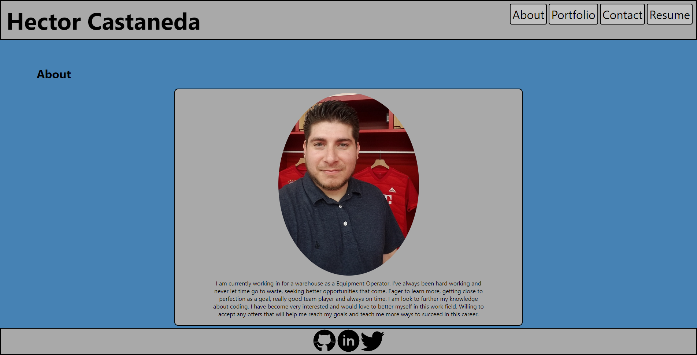

# React Portfolio

## Description

This portfolio was created using react. Shows all my past projects that i have done, also gives you information about the author. Along with a way to contact author should you have any questions.

## Installation

```
npm install
```

```
npm start
```

## Screenshot



## Link

https://hectcast508.github.io/react-portfolio/

## Author

Hector Castaneda strides to learn all he can in web development. To achieve the ability to become a full stack developer. Please visit his github: https://github.com/Hectcast508.
